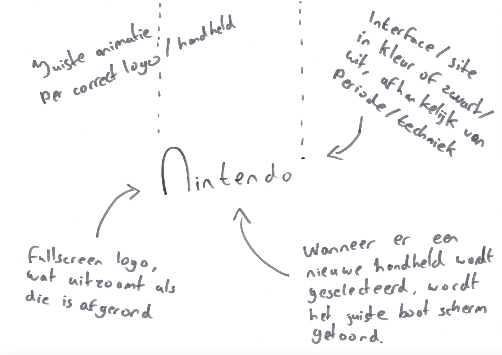

# Procesverslag
Markdown is een simpele manier om HTML te schrijven.  
Markdown cheat cheet: [Hulp bij het schrijven van Markdown](https://github.com/adam-p/markdown-here/wiki/Markdown-Cheatsheet).

Nb. De standaardstructuur en de spartaanse opmaak van de README.md zijn helemaal prima. Het gaat om de inhoud van je procesverslag. Besteedt de tijd voor pracht en praal aan je website.

Nb. Door *open* toe te voegen aan een *details* element kun je deze standaard open zetten. Fijn om dat steeds voor de relevante stuk(ken) te doen.

## Jij

### Ontwerper:
Rowin Schmidt

#### Je startniveau:
Zwart

# Je plan

  
De eerste versie/schets van je ontwerp & je persoonlijke uitdaging

  ### De eerste versie/schets:
  
  
  

  ### Je ambitie: 
  Aan deze technieken/punten wil ik werken:
  - Beter worden in het gebruiken van shadows / gradients en de achterliggende code daarvan > om op een realistische manier een object te maken in code (zodat het net echt lijkt).
  - Nette code schrijven dat overzichtelijk is (ook als er geen classes worden gebruikt).
  - Een leuke/coole interactieve website maken met een twist.
 

## Voortgang/Feedback 1

  
Feedback van Bryan

  ### Bevinding 1:
  Tijdens de eerste feedback ronde had ik nog niet veel om te laten zien, dus veel moest nog worden uitgewerkt. Echter is er positieve feedback gegeven op de schetsen.

  #### oplossing:
  Zo maak ik goed gebruik van progressive disclosure (dmv de lijst in de interface om een handheld te selecteren) en zit het concept goed in elkaar om uit te kunnen gaan werken.

  ### Bevinding 2:
  Ook kwam naar voren dat het wellicht leuk is om naast het tonen van de de handhelds, ook nog wat extra's toe te voegen in het scherm of in het algemeen als easteregg.

  #### oplossing:
  Ik ga dus binnen het scherm nog wat animaties toevoegen en ik zal kijken waar een easteregg passend is per apparaat. Zo moet deze natuurlijk niet teveel opvallen, maar moet het wel leuk zijn om te kunnen ontdekken.

  ### Bevinding 3:
  Het uitwerken van 5+ handhelds zal op deze manier te veel tijd kosten voor deze periode.
  
  #### oplossing:
  Ik ga nu maximaal 3 handhelds uitwerken: de eerste gameboy, de DS Lite en de Switch. Zo heb ik een overbrugging van telkens 10/15 jaar en laat ik dus alsnog een tijdlijn zien, maar dan meer globaal.

## Voortgang/Feedback 2

  
Het proces

  
  ### Uitwerking 1:
  Na het schetsen begin je met het omzetten naar code.Om een realistisch beeld te maken uit code, trek ik de afbeelding van het desbetreffende apparaat als het ware over door deze achter de html elementen te positioneren. De html elementen hebben dan een lichte opacity, zodat ik deze precies op de juiste plek kan zetten. Eerst werk ik globaal de elementen uit d.m.v. felle kleuren en later zal ik deze omzetten naar de correcte kleur. Als laatste stap voeg ik dingen als shading en shadows toe om het beeld realistischer te maken.

  
  
  
  
  

  ### Uitwerking 2:
   Uiteindelijk worden de elementen dus volledig met schaduw en shading aangevuld, waardoor het er behoorlijk realistisch uit gaat zien. Ook de interface met het menu is afgerond. Hier kan je switchen naar de andere apparaten (door te klikken op start, wordt dit scherm geopend). Dit is het resultaat van de GameBoy.

  
  

  
Feedback van Sophie

  
  ### Bevinding 1:
  De meeste punten in de checklist heb ik goed afgerond, echter zijn er natuurlijk altijd verbeterpunten of tips voor in het vervolgproces. Wel kwam naar voren dat sommige stukken code onnodig complex is gemaakt/
  
  #### oplossing:
  Leesbaarheid van bepaalde stukken code vergroten in het vervolg. Zo zal ik aan een parent een fontsize meegeven met een variabele en zal ik em gebruiken voor siblings ipv telkens deze variabele te gebruiken binnen een calc() functie.
  
  
  ### Bevinding 2:
  Niet alle klikbare elementen zijn nog te interacteren met het toetsenbord.
  
  #### oplossing:
  Zorgen dat de elementen die interactief zijn (buttons) en bepaalde UI elementen zowel via muis als toetsenbord te navigeren is. Dit ga ik doen door de focus, hover en o.a. active state toe te passen in mijn code.
  
  
  ### Bevinding 3:
  Het ontbrak nog aan een titel (h1) en andere tekstelementen.
  
  #### oplossing:
  Aan de pagina ga ik sowieso een h1 toevoegen met andere sub-headings en paragraphs waar nodig.
  
  
  ### Bevinding 4:
  De gebruikte bronnen zijn nog niet in GitHub vermeld.
  
  #### oplossing:
  Toevoegen aan de bronvermelding.
  

## Voortgang/Feedback 3

  
Feedback van Isabelle, Amber en Yunus

  
  ### Bevinding 1:
  Achtergrond voelt nog wat saai aan, kan leuker of interessanter worden. 

  #### oplossing:
  Het toevoegen van een achtergrond(kleur) om per apparaat een onderscheid te maken.

  ### Bevinding 2:
  In plaats van een spelletje uitwerken, misschien meer focussen op de interface van het apparaat.

  #### oplossing:
  Voornamelijk de focus leggen op het apparaat an sich en niet de dingen daaromheen en dus ook niet de spellen die gespeeld kunnen worden, maar eerder het hoofdmenu etc.

  ### Bevinding 3:
  Mogelijke extra's toevoegen tijdens het opstarten/interacteren van het apparaat.
  
  #### oplossing:
  Geluidjes toevoegen (passend bij het apparaat) tijdens het opstarten. Mogelijke "eastereggs" of verrassingen/delighters toevoegen. Dat zal donderdag duidelijk worden, of je moet ze al zelf ontdekt hebben :D.
  
  
  ### Bevinding 4:
  Voor de switch mogelijk een Mii karakter toevoegen aan de interface?
  
  #### oplossing:
  Account selectie namaken van de switch interface, waar een Mii karakter is te zien.
  
  
  ### Bevinding 5:
  Meer interacties mogelijk maken met het apparaat en aangeven welke interacties er mogelijk zijn.
  
  #### oplossing:
  D-PAD en andere knoppen klikbaar maken en waar mogelijk, misschien ook het touchscreen. Ergens in beeld een soort legenda maken van iconen met de klikbare knoppen op dat moment.

## Reflectie

  
Mijn eindresultaat & persoonlijke ontwikkeling

  ### Je uitkomst - karakteristiek screenshot(s):
  
  

  ### Dit ging goed/Heb ik geleerd: 
  Het intensief gebruiken van meerder box-shadows binnen hetzelfde element, heb ik nooit eerder gedaan. Dit was dus even goed begrijpen hoe de volgorde in elkaar zit van de "lagen" en hoe je bv spread geeft. Echter pakte ik dit al snel op en voelde het al erg natuurlijk aan na een aantal elementen. Ik denk dat dat ook goed terug te zien is in de verschillende uitwerkingen. Zo ben ik begonnen met de GameBoy, waar het wat moeilijker ging dan met de DS en is dat naar mijn mening terug te zien in de mate van realisme in de apparaten.

  

  ### Dit was lastig/Is niet gelukt:
  Ik was er al vrij snel zeker van dat ik variabele wilde gaan gebruiken bij het maken van de apparaten. Echter heb ik het bij het eerste apparaat voor mijzelf te moeilijk gemaakt, terwijl dat nergens voor nodig was. Zo gebruik ik telkens een calc functie die de variabele op een andere manier "schaalt". Tijdens het uitwerken van de DS en de feedback van Sophie, dat ze het heel moeilijk te lezen vond, heb ik dus bedacht dat ik de handheld parent een font size geef a.d.h.v. de variabele en dat ik dan voor de afmetingen in de siblings telkens em gebruik. Zo blijft de code veel overzichtelijk voor mij, maar helemaal voor anderen.

  
  
  
  ### Hoe nu verder?
  Ik ga nu nog verder met het verder uitwerken van de Switch en de bijhorende interacties. Ook zal ik de interface elementen van de andere handhelds verfijnen. Het interactief maken van alle knoppen ben ik ook mee bezig. Nu zijn ze dat nog niet, aangezien er geen functie achter zit.
  
  ### Hoe is het verder verlopen?
  Uiteindelijk heb ik de belangrijkste dingen van m'n concept afgerond, maar zijn er zeker nog wel dingen die ik graag had willen doen als ik meer tijd had gehad. Zo had ik graag nog de hele interface na willen maken en dus ook meer interactie met het apparaat. Wel ben ik natuurlijk blij met het resultaat en heb ik zeker nieuwe dingen geleerd. Bij de Switch heb ik voor het eerst gewerkt met een SVG filter als clip-path op een element en zou daar graag nog meer over willen leren. Echter ben ik al blij met de mate van realisme in de uitwerkingen en kan ik dus niet ontevreden terug kijken op de afgelopen periode.

## Bronnenlijst

continu bijhouden terwijl je werkt

Nb. Wees specifiek ('css-tricks' als bron is bijv. niet specifiek genoeg).

1. https://gomakethings.com/how-to-access-and-use-data-attributes-in-your-css/
2. https://stackoverflow.com/questions/6268508/restart-animation-in-css3-any-better-way-than-removing-the-element
3. https://developer.mozilla.org/en-US/docs/Web/API/BatteryManager/level
4. https://developer.mozilla.org/en-US/docs/Learn/Tools_and_testing/Cross_browser_testing/Feature_detection
5. https://developer.mozilla.org/en-US/docs/web/javascript/reference/global_objects/date
6. https://stackoverflow.com/questions/14387690/how-can-i-show-only-corner-borders
7. https://developer.mozilla.org/en-US/docs/Web/CSS/gradient/conic-gradient
8. https://css-tricks.com/almanac/properties/c/clip-path/
9. https://yoksel.github.io/relative-clip-path/

