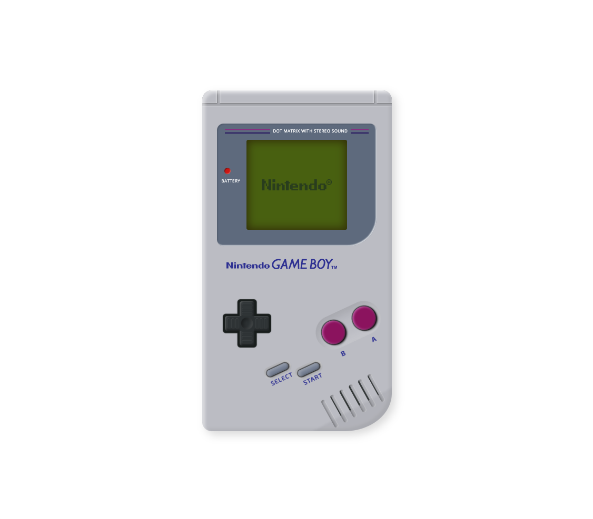

# Procesverslag
Markdown is een simpele manier om HTML te schrijven.  
Markdown cheat cheet: [Hulp bij het schrijven van Markdown](https://github.com/adam-p/markdown-here/wiki/Markdown-Cheatsheet).

Nb. De standaardstructuur en de spartaanse opmaak van de README.md zijn helemaal prima. Het gaat om de inhoud van je procesverslag. Besteedt de tijd voor pracht en praal aan je website.

Nb. Door *open* toe te voegen aan een *details* element kun je deze standaard open zetten. Fijn om dat steeds voor de relevante stuk(ken) te doen.

## Jij

### Ontwerper:
Rowin Schmidt

#### Je startniveau:
Zwart

# Je plan

  
De eerste versie/schets van je ontwerp & je persoonlijke uitdaging

  ### De eerste versie/schets:
  
  
  

  ### Je ambitie: 
  Aan deze technieken/punten wil ik werken:
  - Beter worden in het gebruiken van shadows / gradients en de achterliggende code daarvan > om op een realistische manier een object te maken in code (zodat het net echt lijkt).
  - Nette code schrijven dat overzichtelijk is (ook als er geen classes worden gebruikt).
  - Een leuke/coole interactieve website maken met een twist.
 

## Voortgang/Feedback 1

  
Feedback van Bryan

  ### Bevinding 1:
  Tijdens de eerste feedback ronde had ik nog niet veel om te laten zien, dus veel moest nog worden uitgewerkt. Echter is er positieve feedback gegeven op de schetsen.

  #### oplossing:
  Zo maak ik goed gebruik van progressive disclosure (dmv de lijst in de interface om een handheld te selecteren) en zit het concept goed in elkaar om uit te kunnen gaan werken.

  ### Bevinding 2:
  Ook kwam naar voren dat het wellicht leuk is om naast het tonen van de de handhelds, ook nog wat extra's toe te voegen in het scherm of in het algemeen als easteregg.

  #### oplossing:
  Ik ga dus binnen het scherm nog wat animaties toevoegen en ik zal kijken waar een easteregg passend is per apparaat. Zo moet deze natuurlijk niet teveel opvallen, maar moet het wel leuk zijn om te kunnen ontdekken.

  ### Bevinding 3:
  Het uitwerken van 5+ handhelds zal op deze manier te veel tijd kosten voor deze periode.
  
  #### oplossing:
  Ik ga nu maximaal 3 handhelds uitwerken: de eerste gameboy, de DS Lite en de Switch. Zo heb ik een overbrugging van telkens 10/15 jaar en laat ik dus alsnog een tijdlijn zien, maar dan meer globaal.

## Voortgang/Feedback 2

  
Het proces

  
  ### Uitwerking 1:
  Na het schetsen begin je met het omzetten naar code.Om een realistisch beeld te maken uit code, trek ik de afbeelding van het desbetreffende apparaat als het ware over door deze achter de html elementen te positioneren. De html elementen hebben dan een lichte opacity, zodat ik deze precies op de juiste plek kan zetten. Eerst werk ik globaal de elementen uit d.m.v. felle kleuren en later zal ik deze omzetten naar de correcte kleur. Als laatste stap voeg ik dingen als shading en shadows toe om het beeld realistischer te maken.

  
  
  
  
  

  ### Uitwerking 2:
   Uiteindelijk worden de elementen dus volledig met schaduw en shading aangevuld, waardoor het er behoorlijk realistisch uit gaat zien. Ook de interface met het menu is afgerond. Hier kan je switchen naar de andere apparaten (door te klikken op start, wordt dit scherm geopend). Dit is het resultaat van de GameBoy.

  
  

  
Feedback van Sophie

  
  ### Bevinding 1:
  De meeste punten in de checklist heb ik goed afgerond, echter zijn er natuurlijk altijd verbeterpunten of tips voor in het vervolgproces. Wel kwam naar voren dat sommige stukken code onnodig complex is gemaakt/
  
  #### oplossing:
  Leesbaarheid van bepaalde stukken code vergroten in het vervolg. Zo zal ik aan een parent een fontsize meegeven met een variabele en zal ik em gebruiken voor siblings ipv telkens deze variabele te gebruiken binnen een calc() functie.
  
  
  ### Bevinding 2:
  Niet alle klikbare elementen zijn nog te interacteren met het toetsenbord.
  
  #### oplossing:
  Zorgen dat de elementen die interactief zijn (buttons) en bepaalde UI elementen zowel via muis als toetsenbord te navigeren is. Dit ga ik doen door de focus, hover en o.a. active state toe te passen in mijn code.
  
  
  ### Bevinding 3:
  Het ontbrak nog aan een titel (h1) en andere tekstelementen.
  
  #### oplossing:
  Aan de pagina ga ik sowieso een h1 toevoegen met andere sub-headings en paragraphs waar nodig.
  
  
  ### Bevinding 4:
  De gebruikte bronnen zijn nog niet in GitHub vermeld.
  
  #### oplossing:
  Toevoegen aan de bronvermelding.
  

## Voortgang/Feedback 3

  
Mijn bevindingen + wijzigingen (minimaal 5)

  
  ### Bevinding 1:
  Omschrijving van wat er nog niet orde was (tekst en afbeeding(en)).

  #### oplossing:
  Beschrijving hoe je het hebt hebt opgelost of als het niet gelukt is hoe je het zou oplossen (tekst en afbeeding(en)).

  ### Bevinding 2:
  Omschrijving van wat er nog niet orde was (tekst en afbeeding(en)).

  #### oplossing:
  Beschrijving hoe je het hebt hebt opgelost of als het niet gelukt is hoe je het zou oplossen (tekst en afbeeding(en)).

  ### Bevinding 3:
  ...

## Reflectie

  
Mijn eindresultaat & persoonlijke ontwikkeling

  ### Je uitkomst - karakteristiek screenshot(s):
  

  ### Dit ging goed/Heb ik geleerd: 
  Korte omschrijving met plaatje(s)

  

  ### Dit was lastig/Is niet gelukt:
  Korte omschrijving met plaatje(s)

  

## Bronnenlijst

continu bijhouden terwijl je werkt

Nb. Wees specifiek ('css-tricks' als bron is bijv. niet specifiek genoeg).

1. bron 1
2. bron 2
3. ...

